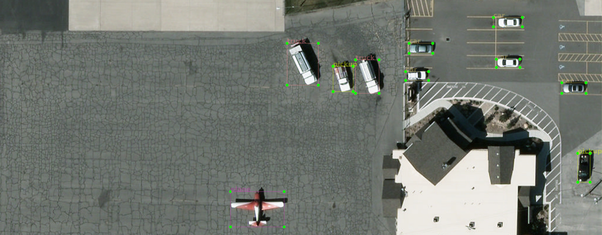
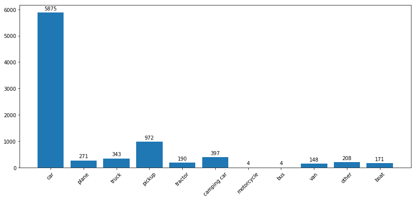

# VEDAI

####  English
[VEDAI](https://downloads.greyc.fr/vedai/) dataset.</br>
All images converted to `.jpg`  </br>
All annotations are standartized to `xml` ImageNet standart.</br>
For view selected object use [LabelImg](https://github.com/tzutalin/labelImg)   </br>

 


## Number of classes in dataset
 
After the script finishes, you will get a clean `xml` file according to Imagenet standards

For generate `xml` run `main.py`

```bash
python main.py
```

## Classes:  
```
1 - car  
2 - truck  
3 - pickup  
4 - tractor  
5 - camping  
6 - boat  
7 - motorcycle  
9 - bus  
10 - van  
11 - other  
12 - small car  
13 - large car  
31 - plane 
23 - board
```  

## List of excluded images  
You can find it in `/unmarked`

```
00000024.jpg  
00000039.jpg  
00000522.jpg  
00000606.jpg  
00000887.jpg  
00001185.jpg  
00000028.jpg  
00000424.jpg  
00000560.jpg  
00000717.jpg  
00001143.jpg  
00001244.jpg  
00000034.jpg  
00000425.jpg  
00000600.jpg  
00000878.jpg  
00001145.jpg  
00001248.jpg
```
 


